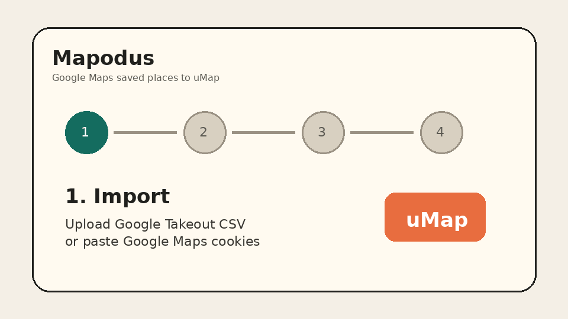

# Mapodus

Mapodus migrates Google Maps saved places to uMap while preserving lists,
metadata, and recoverable coordinates.



## Features

- **Desktop app** - Tauri app for macOS, Windows, and Linux with the backend embedded in the same process.
- **CLI mode** - headless conversion from Google Takeout CSV/JSON or GeoJSON to uMap-ready GeoJSON.
- **Live Google Maps import** - paste Google Maps cookies to fetch saved lists and places directly.
- **Google Takeout import** - upload a Saved.csv export or compatible JSON/GeoJSON; missing coordinates are extracted from URLs when possible.
- **Cookie-based enrichment** - optionally paste Google Maps cookies to fill in missing addresses and coordinates.
- **uMap upload** - creates a new map, or one map per imported Google list, with bilingual properties.
- **Settings** - configure uMap defaults, credentials, developer mode, and Google Maps API enrichment.

## Desktop

Use the desktop app for the normal guided workflow. It starts the Axum backend
inside the Tauri process, so you do not need to run a separate server.

### Prerequisites

- Rust nightly toolchain
- Node.js 22+ and npm
- Tauri system dependencies for your OS

### Run Locally

```bash
cd frontend
npm install
npm run build
cd ../desktop/src-tauri
cargo tauri dev
```

### Desktop Settings

Non-sensitive desktop settings are stored in the OS app config directory:

| OS | Config path |
|----|-------------|
| Linux | `~/.config/mapodus/config.toml` |
| macOS | `~/Library/Application Support/mapodus/config.toml` |
| Windows | `%APPDATA%\mapodus\config.toml` |

The config file contains only non-sensitive values:

```toml
umap_default_url = "https://umap.openstreetmap.fr/en/"
umap_account = "your-umap-username"
locale = "en"
dev_mode = false
```

Secrets such as Google cookies, uMap passwords, OAuth tokens, and session
cookies must not be stored in this config file. In desktop mode, saved secrets
use the OS credential vault/keychain.

### Desktop Releases

Pushing a version tag creates a GitHub Release:

```bash
git tag v0.1.0
git push origin v0.1.0
```

The release workflow builds and uploads:

- macOS `.dmg`
- Windows `.msi`
- Linux `.AppImage`
- Linux binary archive `.tar.gz`
- GitHub source code `.zip`
- GitHub source code `.tar.gz`

## CLI

```bash
mapodus [OPTIONS]
```

| Flag | Description |
|------|-------------|
| `-t, --takeout <FILE>` | Path to Google Takeout CSV or JSON/GeoJSON file |
| `-g, --geojson <FILE>` | Path to existing GeoJSON file |
| `-o, --output <FILE>` | Output GeoJSON file path; skips uMap upload |
| `--umap-url <URL>` | uMap instance URL; default: `https://umap.openstreetmap.fr/en/` |
| `--umap-map-id <ID>` | Existing uMap map ID to upload to |
| `--create-map <NAME>` | Create a new uMap map with this name before uploading |
| `--umap-cookie <COOKIE>` | uMap session cookie, for example `sessionid=xxx; csrftoken=xxx` |
| `--layer-name <NAME>` | Target layer name; default: `Google Maps Saved` |

### CLI Examples

```bash
# Convert Google Takeout CSV to GeoJSON locally
mapodus --takeout ./Saved.csv --output ./places.geojson

# Create a new uMap map and upload places
mapodus --takeout ./Saved.csv \
  --create-map "Google Maps Saved" \
  --umap-cookie "sessionid=xxx; csrftoken=xxx"

# Upload to an existing uMap map
mapodus --takeout ./Saved.csv \
  --umap-map-id 123456 \
  --umap-cookie "sessionid=xxx; csrftoken=xxx"
```

## Authentication

### Google Maps Cookies

1. Open [google.com/maps](https://www.google.com/maps) in your browser.
2. Open Developer Tools, then Application, then Cookies.
3. Select `https://www.google.com`.
4. Copy the cookies as a semicolon-separated string.
5. Paste the string into the Google Maps import or enrichment form.

Cookies expire and may grant access to private account data. Do not commit
cookies or paste them into issues, logs, fixtures, or screenshots.

### uMap Desktop Login

1. Choose or enter your uMap instance URL.
2. Enter your uMap username and password in the **Connect uMap** step.
3. Mapodus authenticates with uMap and uploads the selected places.

### uMap CLI Cookies

1. Log in to your uMap instance in your browser.
2. Copy the `sessionid` and `csrftoken` cookies.
3. Pass them with `--umap-cookie "sessionid=xxx; csrftoken=xxx"`.

## Settings

The Settings page, opened with the gear icon, configures:

| Setting | Description |
|---------|-------------|
| uMap Default URL | uMap instance URL used by default |
| uMap Account | Optional username used to prefill uMap login |
| uMap Password | Stored in the OS keychain in desktop mode; session-only in web/server mode |
| Google Maps API Key | Optional Places API key for coordinate enrichment |
| Language | English or Traditional Chinese (`zh-TW`); i18n work is still under development in #25 |
| Developer Mode | Enables debug API routes |

Server defaults can also be configured with environment variables:

```bash
UMAP_DEFAULT_URL=https://umap.openstreetmap.fr/en/
# UMAP_URL is accepted as a fallback alias
GOOGLE_MAPS_API_KEY=your-google-maps-api-key
DEV_MODE=true
```

## Self-Hosted uMap

Mapodus works with the public uMap service or a self-hosted uMap instance.
Self-hosting is useful when you want private infrastructure, higher upload
limits, or full control over exported maps.

1. Deploy uMap using the official uMap documentation for your target host.
2. Create a user account and confirm you can create a map manually.
3. Set the Mapodus uMap URL to your instance root, including the language path when required, for example `https://maps.example.com/en/`.
4. Use the Desktop **Connect uMap** step with that URL and account, or pass it to the CLI with `--umap-url`.
5. Import Google Maps saved lists and transfer them to the self-hosted instance.

## Development

The web UI is intended for development and debugging. End users should prefer the
Desktop app or CLI.

```bash
# Build the backend
cargo build --workspace

# Build the frontend
cd frontend
npm install
npm run build
cd ..

# Optional settings
# UMAP_DEFAULT_URL or UMAP_URL: default uMap instance URL
# GOOGLE_MAPS_API_KEY: resolve missing POI coordinates
# DEV_MODE=true: enable debug API routes

# Start the backend on http://localhost:8900
cargo run --bin web

# Start the frontend dev server on http://localhost:5173
cd frontend
npm run dev
```

The frontend dev server proxies `/api` requests to `http://localhost:8900`.
Use it only when debugging or developing the web flow.

The web server also accepts optional CLI flags:

| Flag | Description |
|------|-------------|
| `--google-cookies <COOKIES>` | Google Maps cookies for dev mode; imports and prints saved lists on startup |

## Testing

Before committing Rust changes, run:

```bash
cargo fmt
cargo clippy --workspace --all-targets --all-features
cargo test --workspace --all-features
cargo build --workspace
```

When changing frontend files, run the relevant script from `frontend/package.json`:

```bash
cd frontend
npm run build
```

## Project Structure

```text
├── core/           # Core library: parsing, conversion, API clients
├── cli/            # CLI binary
├── web/            # Web server and API routes
├── frontend/       # Svelte SPA
├── desktop/        # Tauri desktop app
├── assets/         # README and release media
├── docs/           # Development and architecture documentation
├── examples/       # Test data
└── umap/           # uMap submodule for local testing
```

## License And Support

Mapodus is free software under the Apache-2.0 license. You may use, modify,
and redistribute it under the license terms.

If this project helps you, you can support HY at
[buymeacoffee.com/hychang](https://buymeacoffee.com/hychang).
